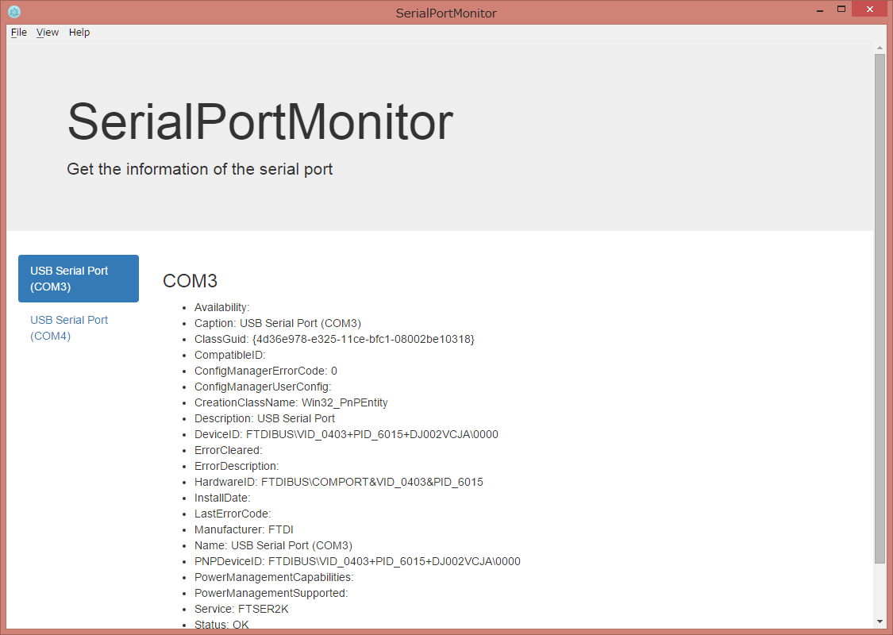

# SerialPortMonitor

とりあえずシリアルポートのリストを表示します。
(Windows用)



###使い方
```
$ npm install
$ cd ./src
$ npm install
$ cd ../
$ npm start
```

###ライブラリとか
- [Electron](http://electron.atom.io/)
- [Edge.js](http://tjanczuk.github.io/edge/)
- [React](https://facebook.github.io/react/)
- [React-Bootstrap](https://react-bootstrap.github.io/)
