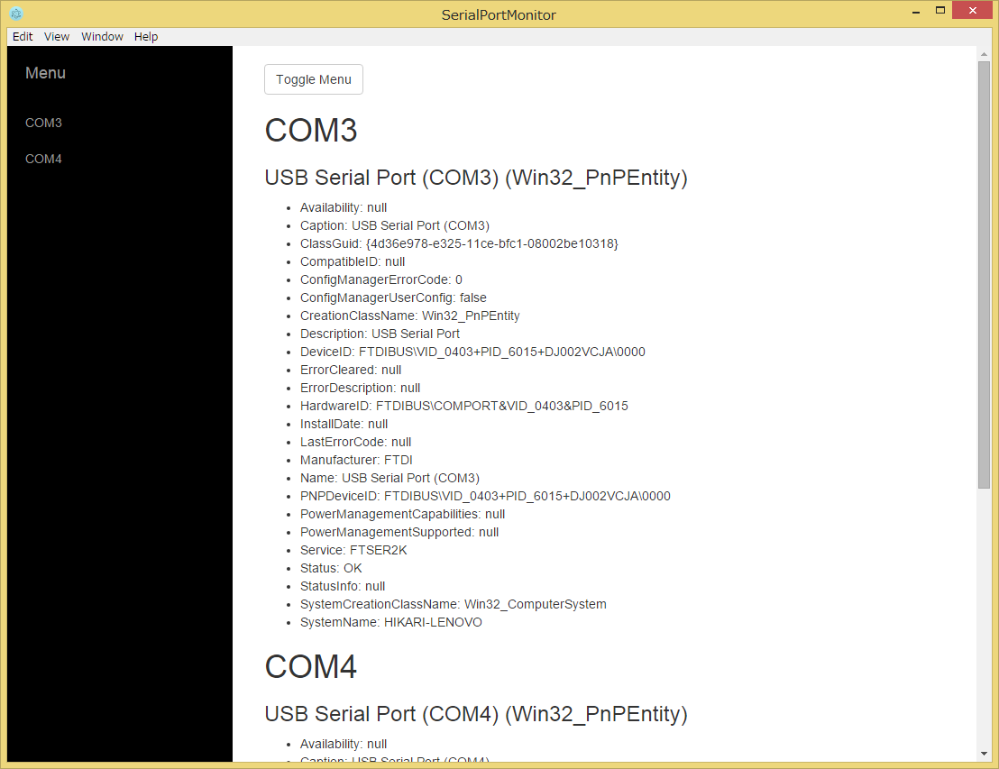

# SerialPortMonitor

とりあえずシリアルポートのリストを表示します。
(Windows用)



###使い方
```
$ npm install
$ cd ./src
$ npm install
$ cd ../
$ npm start
```

###ライブラリとか
- [Electron](http://electron.atom.io/)
- [electron-compile](https://github.com/electronjs/electron-compile)
- [Edge.js](http://tjanczuk.github.io/edge/)
- [electron-edge](https://github.com/kexplo/electron-edge)
- [Reactive Extensions](http://rx.codeplex.com/)
- [RxJS](http://reactivex.io/)
- [Cycle.js](http://cycle.js.org/)
- [hyperscript-helpers](https://github.com/ohanhi/hyperscript-helpers)
- [jQuery](https://jquery.com/)
- [Bootstrap](http://getbootstrap.com/)
- [Simple Sidebar](https://github.com/IronSummitMedia/startbootstrap-simple-sidebar)
- [React](https://facebook.github.io/react/)
- [React-Bootstrap](https://react-bootstrap.github.io/)
